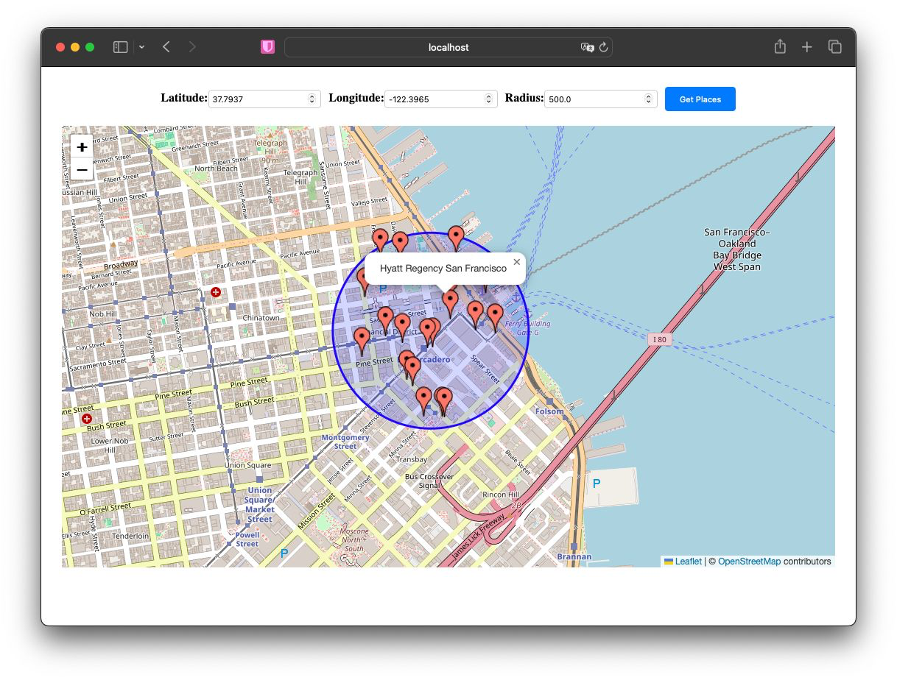

# Place API Cache
 
https://wonderful-tree-0dda24310.4.azurestaticapps.net/

## Contents
- [Place API Cache](#place-api-cache)
  - [Contents](#contents)
  - [Description](#description)
  - [Technologies](#technologies)
  - [Installation](#installation)
    - [Prerequisites](#prerequisites)
    - [Client](#client)
    - [Backend](#backend)
  - [Screenshots](#screenshots)

## Description

Full-Stack application that caching Google Places API.


## Technologies
- Java 17
- Spring Boot 3.2.1 
- ReactJS
- PostgreSQL
- Azure

## Installation

### Prerequisites

- Clone or download this repository.
```shell
git clone 'https://github.com/sapazutku/PlacesMap.git'
```
- Google Places API.
- `application.properties` file

### Client

```shell
cd client
npm start
```
React application runs on port:3000.

### Backend
```shell
mvn clean install
mvn spring-boot:run
```
or open with Intellij Idea.
Spring app runs on port: 8070


## Screenshots
